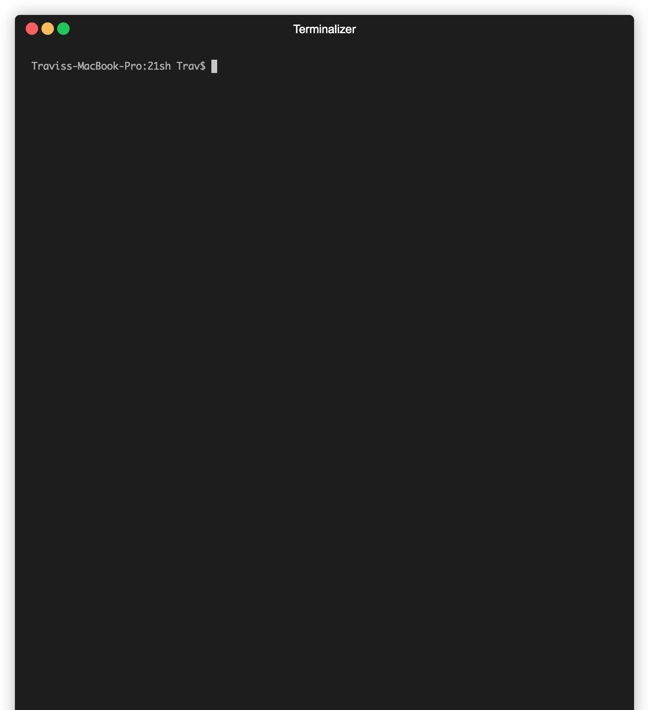

[![Contributors][contributors-shield]][contributors-url]
[![Forks][forks-shield]][forks-url]
[![Stargazers][stars-shield]][stars-url]
[![Issues][issues-shield]][issues-url]
[![MIT License][license-shield]][license-url]
[![LinkedIn][linkedin-shield]][linkedin-url]


<!-- TABLE OF CONTENTS -->
<details open="open">
  <summary>Table of Contents</summary>
  <ol>
    <li>
      <a href="#about-the-project">About The Project</a>
      <ul>
        <li><a href="#built-with">Built With</a></li>
      </ul>
    </li>
    <li>
      <a href="#getting-started">Getting Started</a>
      <ul>
        <li><a href="#prerequisites">Prerequisites</a></li>
        <li><a href="#installation">Installation</a></li>
      </ul>
    </li>
    <li><a href="#usage">Usage</a></li>
    <li><a href="#roadmap">Roadmap</a></li>
    <li><a href="#contributing">Contributing</a></li>
    <li><a href="#license">License</a></li>
    <li><a href="#contact">Contact</a></li>
    <li><a href="#references">References</a></li>
  </ol>
</details>


<!-- ABOUT THE PROJECT -->
## About The Project



21sh is a functional BASH-like shell, written in C. Supports process creation along with logical operators, redirection and line edition.
### Built With

- C and standard libraries


<!-- GETTING STARTED -->
## Getting Started


### Prerequisites

The only dependency required for local compilation is a C compiler (developed with `gcc`)

### Installation

1. Clone the repo
   ```sh
   git clone https://github.com/travmatth/21sh.git
   ```
3. compile
   ```sh
   make
   ```


<!-- USAGE EXAMPLES -->
## Usage

To run the program:
```sh
./21sh
```

Controls:
```
21sh:

Movement: 
Move cursor left: (left key)
Move cursor right: (right key)
Move cursor one word left: Ctrl-(left key)
Move cursor one word right: Ctrl-(right key)
Move up one line: Ctrl-(up key)
Move down one line: Ctrl-(up key)
Move cursor to beginning of command: Home key
Move cursor to end of command: End key

Manipulate Text:
Cut current line: Opt-x
Paste line: Opt-p
Copy line: Opt-c
Backspace: Backspace or delete

Selecting Text:
Select left: Shift-(left key)
Select right: Shift-(right key)
Cancel selection: Esc
Select up one line: Shift-(up key)
Select down one line: Shift-(down key)

Manipulate selection:
Copy selection: Ctrl-c
Paste selection: Ctrl-p
Cut selection: Ctrl-x

History: 
Prev history (can only activate when cursor at the end of line): (up key)
Next history (can only activate when cursor at the end of line): (down key)
```


<!-- ROADMAP -->
## Roadmap

See the [open issues](https://github.com/othneildrew/Best-README-Template/issues) for a list of proposed features (and known issues).


<!-- CONTRIBUTING -->
## Contributing

Contributions are what make the open source community such an amazing place to be learn, inspire, and create. Any contributions you make are **greatly appreciated**.

1. Fork the Project
2. Create your Feature Branch (`git checkout -b feature/AmazingFeature`)
3. Commit your Changes (`git commit -m 'Add some AmazingFeature'`)
4. Push to the Branch (`git push origin feature/AmazingFeature`)
5. Open a Pull Request


<!-- LICENSE -->
## License

Distributed under the MIT License. See `LICENSE` for more information.


<!-- CONTACT -->
## Contact

Travis Matthews - [github](https://github.com/travmatth)

Project Link: [https://github.com/travmatth/21sh](https://github.com/travmatth/21sh)


<!-- REFERENCES -->
## References

- [Shell Command Language](https://pubs.opengroup.org/onlinepubs/9699919799/)
- [Engineering A Compiler, 2nd Edition](https://www.amazon.com/Engineering-Compiler-Keith-Cooper/dp/012088478X)


<!-- MARKDOWN LINKS & IMAGES -->
<!-- https://www.markdownguide.org/basic-syntax/#reference-style-links -->
[contributors-shield]: https://img.shields.io/github/contributors/travmatth/21sh.svg?style=for-the-badge
[contributors-url]: https://github.com/travmatth/21sh/graphs/contributors
[forks-shield]: https://img.shields.io/github/forks/travmatth/21sh.svg?style=for-the-badge
[forks-url]: https://github.com/travmatth/21sh/network/members
[stars-shield]: https://img.shields.io/github/stars/travmatth/21sh.svg?style=for-the-badge
[stars-url]: https://github.com/travmatth/21sh/stargazers
[issues-shield]: https://img.shields.io/github/issues/travmatth/21sh.svg?style=for-the-badge
[issues-url]: https://github.com/travmatth/21sh/issues
[license-shield]: https://img.shields.io/github/license/travmatth/21sh.svg?style=for-the-badge
[license-url]: https://github.com/travmatth/21sh/blob/master/LICENSE.txt
[linkedin-shield]: https://img.shields.io/badge/-LinkedIn-black.svg?style=for-the-badge&logo=linkedin&colorB=555
[linkedin-url]: https://www.linkedin.com/in/travis-matthews-885228141/
[product-screenshot]: images/screenshot.png
